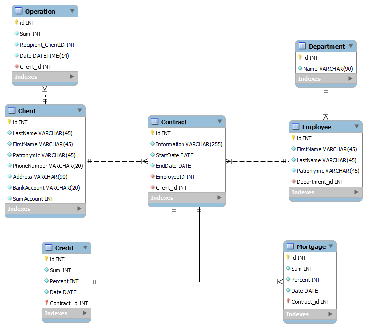

# База данных банка 
---

### Задача
В рамках данного проекта будет разработан информационно-программный комплекс (ИПК) для Банка. Будут составлены инфологическая и даталогическая модели базы данных, а также спроектирован пользовательский интерфейс для работы с ИПК.

### Описание
Банк представляет собой финансовую организацию, предоставляющую услуги клиентам. Он имеет множество отделений, расположенных в разных городах. В центральном офисе находятся базы данных, содержащие информацию о клиентах, их счетах, операциях и кредитах.
Клиенты банка могут открывать счеты на которых хранятся их денежные средства. Каждый счет имеет уникальный номер и привязан к конкретному клиенту. Клиенты могут иметь несколько счетов.
Клиенты могут производить переводы между своими счетами или на счета других клиентов. Каждый перевод имеет уникальный номер и содержит информацию о счетах отправителя и получателя, сумме перевода и дате проведения операции.
Банк также предоставляет клиентам услуги по выдаче кредитов. Каждый кредит имеет уникальный номер и содержит информацию о клиенте-заемщике, сумме кредита, процентной ставке, сроке погашения и ежемесячном платеже.

### Интерфейс
Пользовательский интерфейс написан на языке C# с использованием WPF - система для построения клиентских приложений Windows с визуально привлекательными возможностями взаимодействия с пользователем, графическая (презентационная) подсистема в составе .NET Framework (начиная с версии 3.0), использующая язык XAML.

### Даталогическая схема

